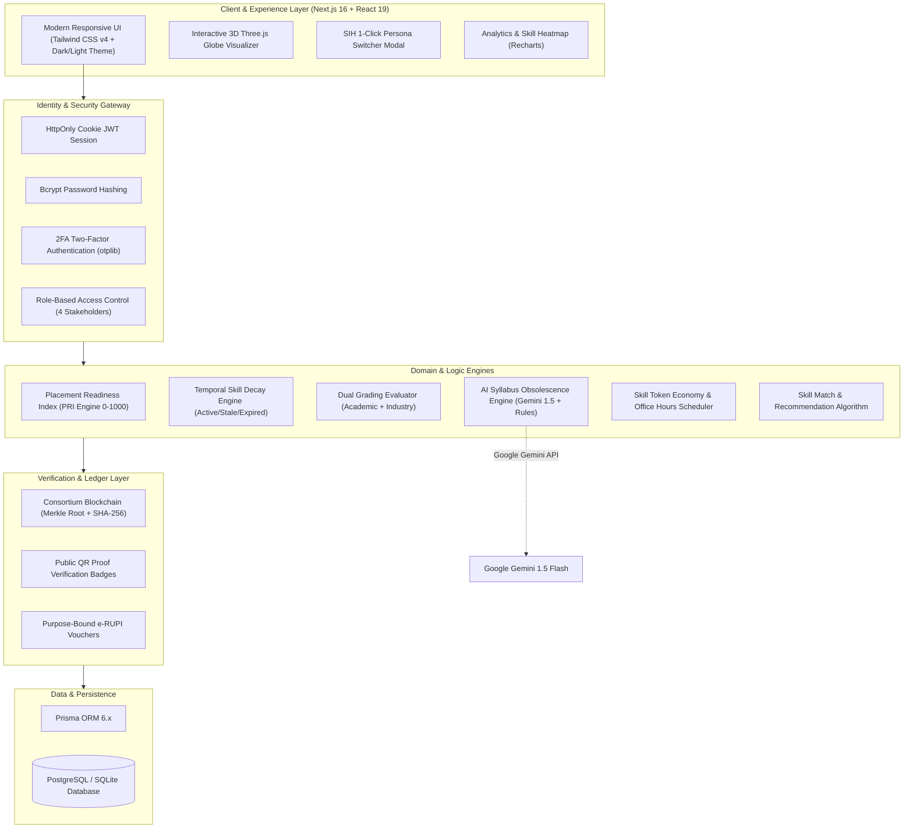
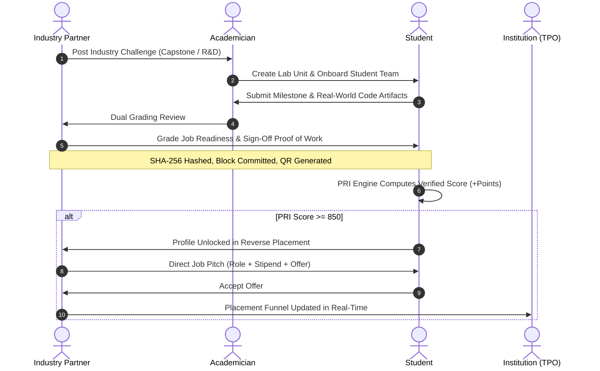

<div align="center">

# 🎓 SkillBridge
### **Next-Gen AI & Blockchain-Powered Academia–Industry Collaboration Ecosystem**

*Empowering Students, Faculty, Industry Leaders, and Academic Institutions through Verifiable Skills, Dual Grading, AI Curriculum Modernization, and Reverse Campus Placement.*

---

[](https://www.sih.gov.in/)
[](https://nextjs.org/)
[](https://react.dev/)
[](https://www.typescriptlang.org/)
[](https://tailwindcss.com/)
[](https://www.prisma.io/)
[](https://ai.google.dev/)
[](https://www.npci.org.in/)

<br />

[⚡ 1-Click Judge Walkthrough](#-sih-evaluator--judge-quick-demo-guide) • [🚀 Key Innovations](#-breakthrough-innovations) • [🏛️ Stakeholder Portals](#-4-way-stakeholder-ecosystem) • [📐 Architecture](#-system-architecture) • [💻 Tech Stack](#-technical-stack) • [🛠️ Setup Guide](#-quick-start--installation)

---

</div>

<br />

## 🌟 Executive Summary & SIH Alignment

In India's higher education ecosystem, **over 80% of engineering graduates are deemed unemployable by industry**, while companies spend months and billions retraining new hires. Syllabi lag industry evolution by 3–5 years, student resumes suffer from rampant credential inflation, and academia remains fundamentally siloed from enterprise demands.

**SkillBridge** directly bridges this divide. Aligned with the **National Education Policy (NEP 2020)**, **AICTE Industry-Academia Guidelines**, and **Digital India**, SkillBridge establishes a frictionless, multi-tenant digital bridge connecting **Students**, **Academicians/Faculty**, **Industry Partners**, and **Educational Institutions (TPOs)**.

```
                    ┌─────────────────────────┐
                    │      SKILLBRIDGE        │
                    │   COLLABORATION PORTAL  │
                    └───────────┬─────────────┘
          ┌─────────────────────┼─────────────────────┐
          ▼                     ▼                     ▼
┌──────────────────┐  ┌──────────────────┐  ┌──────────────────┐
│     STUDENTS     │  │     FACULTY      │  │    INDUSTRY      │
│ • Proof-of-Work  │  │ • Dual Grading   │  │ • Challenges     │
│ • Skill Decay    │  │ • Lab Units      │  │ • Job Pitches    │
│ • PRI Score      │  │ • AI Audit       │  │ • Mentorship     │
│ • Reverse Plcmt. │  │ • Sabbaticals    │  │ • e-RUPI Vouchers│
└─────────┬────────┘  └─────────┬────────┘  └─────────┬────────┘
          └─────────────────────┼─────────────────────┘
                                ▼
                    ┌─────────────────────────┐
                    │      INSTITUTIONS       │
                    │ • Skill Gap Heatmaps    │
                    │ • Accreditation Metrics │
                    │ • Placement Analytics   │
                    └─────────────────────────┘
```

---

## 🚀 Breakthrough Innovations

### 1. 🎯 Placement Readiness Index (PRI Engine: 0 – 1000)
A dynamic, tamper-resistant score that replaces static CGPA with continuous, multidimensional evidence of real-world capability:
- **Skill Competency Score:** Up to 300 pts (Calibrated via diagnostic assessments)
- **Verified Projects Completed:** Up to 250 pts (Verified milestone deliveries)
- **Verifiable Proof of Work:** Up to 150 pts (Faculty + Industry dual signatures)
- **Dual Grading Performance:** Up to 150 pts (Academic marks + Corporate readiness)
- **Mentorship & Office Hours:** Up to 100 pts (Active participation in 1:1 clinics)
- **Industry Challenge Solves:** Up to 50 pts (Micro-consultancies & hackathons)

### 2. 🔄 Reverse Campus Placement (Unlock at PRI > 850)
Flips traditional campus hiring upside down. Students with **PRI ≥ 850** become discoverable in the **Reverse Placement Marketplace**, where verified corporate recruiters send personalized job pitches with stipend, role, and compensation details directly to top talent.

### 3. ⛓️ Cryptographic Proof of Work & Consortium Blockchain
- Every completed milestone undergoes a rigorous **Dual Sign-off Workflow** (Faculty Advisor + Enterprise Mentor).
- Validated records are hashed with SHA-256 and committed into a simulated **Consortium Blockchain Ledger** (Block Hash, Merkle Root, Previous Hash, Validator Nodes).
- Generates **Public QR Badges** that recruiters can scan anywhere to independently verify authentic student output.

### 4. 🧠 AI-Powered Syllabus Obsolescence Engine
- Integrates pattern-matching rules and **Google Gemini 1.5 Flash LLM** to ingest university curricula.
- Automatically flags obsolete topics (e.g., SOAP/CORBA, legacy frameworks) against live industry job requirements.
- Generates instant **Curriculum Patches & Micro-Modules** (e.g., gRPC, GraphQL, Event-Driven Streaming) for faculty boards of study.

### 5. 🎯 Smart Assessments & AI Resume Parsing
- **Dynamic Assessments:** Aptitude, Logical Reasoning, and Technical tracks that automatically pinpoint strengths and upskill gaps into a verified skill graph.
- **AI Resume Parser:** 1-click automatic skill extraction directly into the student's digital portfolio.

### 6. ⚖️ Dual Grading Matrix
- Bridges academic rigor with industry standards.
- Faculty assess academic fundamentals (algorithms, documentation, discipline).
- Corporate leads assess enterprise readiness (production-level code, system design, test coverage, agility).

### 7. ⏳ Temporal Skill Decay Engine
- Recognizes that tech skills have a natural half-life.
- Tracks skills across **ACTIVE ➔ STALE ➔ EXPIRED** states.
- Incentivizes students to recertify, commit code, and attend mentorship clinics to keep their profile current.

### 8. 🎟️ Digital India e-RUPI Vouchers & Skill Token Economy
- **e-RUPI Vouchers:** Purpose-bound digital vouchers issued by corporate CSR/partners for certifications, lab equipment, and student training.
- **Skill Tokens:** Internal token ledger allowing students to book 15-minute 1:1 Office Hours and Code Clinics with verified industry mentors.

### 9. 🌐 Spatial 3D Interactive Globe
- Built using **Three.js** and **React Three Fiber**.
- Visualizes the living network of institutions, industry hubs, and collaborative lab units worldwide directly on the landing page.

---

## 🏛️ 4-Way Stakeholder Ecosystem

| Stakeholder | Key Features & Capabilities | SIH Impact & Value |
|:---|:---|:---|
| **👨‍🎓 Student** | • Multi-factor PRI 0–1000 Tracker<br>• Proof-of-Work Portfolio with QR Verification<br>• Dynamic Skill Assessments & Auto-Resume Parsing<br>• Reverse Placement Job Pitches<br>• 1:1 Mentor Booking & Office Hours<br>• Internship & Apprenticeship Marketplace | Transforms passive learners into verified builders with immutable credentials. |
| **👩‍🏫 Academician** | • Faculty Portal & Industry Sabbatical Exchange<br>• AI Syllabus Obsolescence Audit & Patching<br>• Lab Unit Incubator Management<br>• Dual Grading Evaluation Console<br>• AICTE-Recognized Faculty Development Programs (FDP) | Enables faculty to stay updated with industry trends and engage in paid consultancies. |
| **🏢 Industry Partner** | • Capstone & R&D Challenge Marketplace<br>• Reverse Placement Direct Candidate Outreach<br>• Dual Grading on Real-World Deliverables<br>• Mentor Slot Scheduling & 1:1 Code Clinics<br>• Purpose-Bound e-RUPI Education Voucher Issuance | Drastically cuts hiring turnaround time and retraining costs through verified talent pipelines. |
| **🏛️ Institution / TPO** | • Institutional Admin View & Analytics Dashboard<br>• Department-Level Skill Gap Heatmaps<br>• Real-Time Placement Tracker & Job Pitch Funnel<br>• NAAC, NBA, and NIRF Accreditation Metrics<br>• Industry Partner Directory & MoUs | Provides actionable macro insights to modernize curricula and achieve 100% placement success. |

---

## 📐 System Architecture



---

## 🔄 End-to-End Workflow



---

## ⚡ SIH Evaluator & Judge Quick Demo Guide

For a fast evaluation during your judging rounds:

### 1. Instant 1-Click Demo Switcher
SkillBridge features an integrated **Floating Demo Persona Switcher** at the **bottom-right corner** of the screen. Click on it to instantly switch between all four roles without re-authenticating!

### 2. Pre-Seeded Test Credentials
All demo accounts are pre-configured with password: `Password@123`

| Persona | Role | Seeded Email | Key Areas to Evaluate |
|:---|:---|:---|:---|
| **Aarav Sharma** | `STUDENT` | `aarav.sharma@student.edu` | **PRI Breakdown**, Proof of Work, Skill Decay, Reverse Placement, Portfolio QR |
| **Dr. Rajesh Kumar** | `ACADEMICIAN` | `rajesh.kumar@faculty.edu` | **AI Syllabus Audit**, Dual Grading Console, Lab Units, Sabbatical Listings |
| **Infosys Campus Lead** | `INDUSTRY` | `recruit@infosys.com` | **Post Challenges**, Reverse Placement Pitches, Mentor Slots, Dual Grading |
| **Dr. Lakshmi Narayanan** | `INSTITUTION` | `tpo@university.edu` | **Skill Gap Heatmap**, Placement Tracker, Accreditation Metrics, Partner MoUs |

### 3. Suggested 3-Minute Hackathon Evaluation Flow
1. **Landing Page:** Explore the Three.js 3D Interactive Globe and live collaboration metrics.
2. **Student Dashboard:** Note Aarav Sharma's **Placement Readiness Index (PRI: 850+)** and verified proof-of-work badges.
3. **AI Syllabus Audit:** Switch to **Dr. Rajesh Kumar** (`ACADEMICIAN`), go to **Syllabus**, and trigger the AI audit to see obsolete topics flagged and replaced.
4. **Reverse Placement:** Switch to **Infosys** (`INDUSTRY`), browse high-PRI students, and dispatch a tailored Job Pitch.
5. **Institutional Heatmap:** Switch to **Dr. Lakshmi Narayanan** (`INSTITUTION`) and inspect department-wide skill gap analytics against industry benchmarks.

---

## 💻 Technical Stack

### Frontend & Visual Architecture
- **Framework:** Next.js 16 (App Router with Server Components & Server Actions)
- **UI Runtime:** React 19 + TypeScript
- **Styling:** Tailwind CSS v4 + Vanilla CSS Design System
- **3D Graphics:** Three.js + React Three Fiber (`@react-three/fiber`, `@react-three/drei`)
- **Icons & Theme:** Lucide React + `next-themes` (Full Dark/Light Mode)
- **Data Visualization:** Recharts (Radar, Area, Bar, and Gauge charts)

### Backend, Database & Ledger
- **Runtime:** Node.js (Edge-compatible server actions)
- **ORM:** Prisma Client 6.x (Multi-dialect: PostgreSQL in production, SQLite locally)
- **Security:** JWT (HttpOnly, Secure Cookies) + BcryptJS password hashing
- **Two-Factor Auth:** Time-based One-Time Passwords (`otplib` + QR verification)
- **Blockchain Simulation:** Merkle Tree root hashing, block header chaining, and validation consensus
- **QR Code Engine:** `qrcode` SVG generator for cryptographic credential verification
- **Spreadsheets:** SheetJS (`xlsx`) for institutional placement exports

### AI & Integrations
- **AI Model:** Google Gemini 1.5 Flash (via `@google/genai` / REST integration)
- **Email Delivery:** Nodemailer with responsive HTML templates

---

## 🛠️ Quick Start & Installation

### Prerequisites
- Node.js 18.x or 20.x installed
- Git

### 1. Clone & Install Dependencies
```bash
git clone https://github.com/Phantom-Coders-Team/SkillBridge.git
cd SkillBridge
npm install
```

### 2. Configure Environment Variables
Create a `.env` file in the root directory:
```env
# Database (PostgreSQL or SQLite)
DATABASE_URL="file:./dev.db"

# Authentication
JWT_SECRET="super-secret-jwt-key-for-skillbridge-hackathon"
NEXT_PUBLIC_BASE_URL="http://localhost:3000"

# Optional: Google Gemini API for Real-Time AI Syllabus Audit
GEMINI_API_KEY="your-google-gemini-api-key"

# Optional: Email Service (SMTP)
SMTP_HOST="smtp.gmail.com"
SMTP_PORT="587"
SMTP_USER="your-email@gmail.com"
SMTP_PASS="your-app-password"
```

### 3. Initialize Database & Seed Demo Data
```bash
# Push schema to database
npx prisma db push

# Seed comprehensive SIH demo personas, challenges, and proofs of work
npm run db:seed
```

### 4. Run Development Server
```bash
npm run dev
```
Open [http://localhost:3000](http://localhost:3000) in your browser.

---

## 📁 Repository Structure

```
SkillBridge/
├── prisma/
│   ├── schema.prisma         # 25+ relational models (Users, PRI, Blockchain, e-RUPI, etc.)
│   └── seed.ts               # Pre-seeded SIH personas and real-world scenario data
├── public/                   # Static assets, badges, and icons
├── src/
│   ├── app/
│   │   ├── (app)/            # Authenticated stakeholder application routes
│   │   │   ├── dashboard/    # Unified stakeholder-aware dashboard
│   │   │   ├── assessments/  # Skill assessments & aptitude tracking
│   │   │   ├── analytics/    # Institutional Admin View & aggregate data
│   │   │   ├── pri/          # Placement Readiness Index deep-dive & breakdown
│   │   │   ├── proof-of-work/# Verifiable project proofs & blockchain explorer
│   │   │   ├── reverse-placement/ # Reverse hiring marketplace (PRI 850+)
│   │   │   ├── syllabus/     # AI-driven syllabus obsolescence audit
│   │   │   ├── dual-grading/ # Academic & Industry evaluation console
│   │   │   ├── challenges/   # Industry challenges & capstone marketplace
│   │   │   ├── lab-units/    # Faculty-led incubator teams
│   │   │   ├── heatmap/      # Institutional skill gap analytics
│   │   │   ├── office-hours/ # 1:1 mentor booking via skill tokens
│   │   │   ├── sabbaticals/  # Faculty industrial training & consultancy
│   │   │   └── settings/     # 2FA security, notifications, and profile
│   │   ├── api/              # API endpoints (demo switcher, syllabus, PRI, auth)
│   │   ├── login/            # Role-aware authentication
│   │   ├── signup/           # Multi-tenant onboarding
│   │   └── page.tsx          # 3D interactive landing page
│   ├── components/           # Modular UI components, charts, and 3D Canvas
│   └── lib/                  # PRI calculation, blockchain logic, auth, AI audit
├── package.json
└── README.md
```

---

## 🌍 National Impact & Future Roadmap

```
  [Stage 1: SIH Prototype] ➔ [Stage 2: State Pilot] ➔ [Stage 3: National Rollout]
   • 4 Stakeholders          • 25 Universities        • AICTE/NATS Integration
   • PRI 0-1000 Engine       • Real e-RUPI Banking    • Decentralized DID Credentials
   • Simulated Blockchain    • 100+ Enterprise MoUs   • Millions of Empowered Youth
```

- **NEP 2020 Compliance:** Implements multidisciplinary learning, mandatory internships, and continuous credit bank integration.
- **Accreditation Readiness:** Generates instant audit trails for NAAC Criteria 1 (Curricular Aspects) and Criteria 2 (Teaching-Learning).
- **Decentralized Verification:** Planned transition from consortium simulation to Hyperledger / Polygon ID for verifiable student digital credentials.

---

## 👥 The SkillBridge Team
Developed with passion by **Phantom-Coders-Team** for **Smart India Hackathon (SIH)**.

*Empowering the next generation of engineers, educators, and enterprise leaders.*
