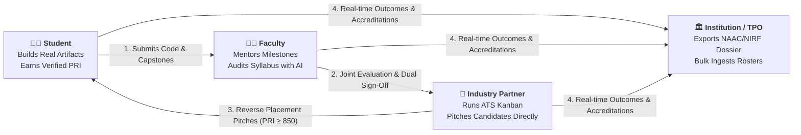
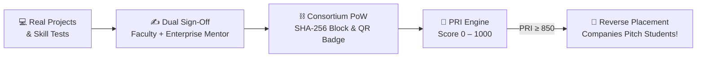
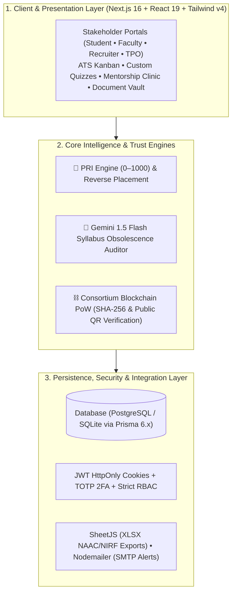

<div align="center">

# 🎓 SkillBridge
### **Next-Gen AI & Cryptographic Academia–Industry Collaboration Platform**
*Bridging the 80% engineering employability gap through verified Proof-of-Work, AI syllabus modernization, ATS hiring pipelines, and Reverse Campus Placement.*

---

[](https://www.sih.gov.in/)
[](https://nextjs.org/)
[](https://react.dev/)
[](https://www.typescriptlang.org/)
[](https://tailwindcss.com/)
[](https://www.prisma.io/)
[](https://ai.google.dev/)
[](#-core-innovations)

<br />

[⚡ Judge Demo Guide](#-sih-judge--evaluator-quick-demo-guide) • [🔄 How It Works](#-how-it-works-in-one-view) • [🎯 PRI & Reverse Placement](#-pri--reverse-placement-flow) • [🚀 Core Innovations](#-core-innovations) • [📐 Architecture](#-system-architecture) • [🛠️ Setup](#️-quick-start)

---

</div>

<br />

## 🌟 Executive Summary

Traditional engineering education suffers from a **3–5 year curriculum lag**, unverifiable resume claims, and siloed academia. **SkillBridge** aligns with **NEP 2020** and **AICTE guidelines** to create a unified ecosystem connecting **Students**, **Faculty**, **Industry Partners (19+ Corporates)**, and **Institutions (TPOs)** through tamper-proof cryptographic proofs, automated AI syllabus modernization, and evidence-driven hiring.

---

## ⚡ SIH Judge & Evaluator Quick Demo Guide

> [!TIP]
> **1-Click Floating Demo Switcher:** Click the widget at the **bottom-right corner** of the screen on any page to switch between all personas instantly without logging out! All demo accounts use password: `PASSWORD@123`.

| Persona | Seeded Demo Email | Role | What Judges Should Test Here |
|:---|:---|:---|:---|
| **👨‍🎓 Aarav Sharma** | `aarav.sharma@student.edu` | `STUDENT` | **PRI Breakdown (850+)**, Public Portfolio (`/portfolio`), Reverse Placement Pitches, Skill Radar & Freshness, Custom Quizzes (`/assessments`) |
| **👩‍🏫 Dr. Rajesh Kumar** | `rajesh.kumar@faculty.edu` | `ACADEMICIAN` | **Faculty Milestone Tracker** (`/faculty-portal`), Issue Cryptographic Certificates, **AI Syllabus Obsolescence Audit** (`/syllabus`), Dual Grading Console |
| **🏢 Infosys Lead** | `recruit@infosys.com` | `INDUSTRY` | **ATS Kanban Board** (6 stages) (`/internships`), Bulk Shortlisting, Interviewer Scorecards, **Custom Assessment Builder** (`/assessments`) |
| **🏛️ Dr. Lakshmi Narayanan** | `tpo@university.edu` | `INSTITUTION` | **AICTE / NAAC / NIRF Accreditation Dossier** (`/analytics`), **Bulk Student Roster Importer** (CSV/Excel), Placement Analytics (`/placements`) |

### ⏱️ Suggested 3-Minute Evaluation Path
1. **Explore Landing Page:** Review the responsive split hero (Campus vs. Corp) and real-time ecosystem stats.
2. **Student & Public Portfolio:** Switch to **Aarav Sharma**, view the **PRI 850+ breakdown**, test the **4-Way Document Vault**, and open the public verification badge at `/verify`.
3. **Industry ATS & Custom Quizzes:** Switch to **Infosys**, open `/internships` to advance candidates across the **ATS Kanban**, submit an **Interviewer Scorecard**, or create a test via the **Assessment Builder**.
4. **Faculty Milestones & AI Syllabus:** Switch to **Dr. Rajesh Kumar**, inspect student milestone submissions, issue a certificate, and run the **Gemini AI Syllabus Audit** to see instant micro-module patches.
5. **Institutional Compliance:** Switch to **Dr. Lakshmi Narayanan**, test the **Bulk Roster Importer**, and preview/export the **AICTE/NAAC/NIRF Accreditation Dossier**.

---

## 🔄 How It Works (In One View)



---

## 🎯 PRI & Reverse Placement Flow

SkillBridge eliminates CGPA bias with the **Placement Readiness Index (PRI: 0–1000)**. When a student reaches **PRI ≥ 850**, the platform flips campus hiring: recruiters proactively send offers with role details and stipend bands directly to the student.



#### PRI Composite Breakdown (1000 Points Max)
- **Skills Competency (300 pts):** Diagnostic skill tests & custom quizzes
- **Verified Projects (250 pts):** Milestone-completed capstones & code repos
- **Proof of Work (150 pts):** Dual cryptographic faculty + mentor sign-offs
- **Joint Evaluation (150 pts):** Academic fundamentals + enterprise code readiness
- **Mentorship & Code Clinics (100 pts):** 1:1 problem-solving sessions
- **Industry Challenges (50 pts):** Corporate problem statements solved

---

## 🚀 Core Innovations

| Innovation | What It Does & Why It Matters | Relevant Routes |
|:---|:---|:---|
| **🎯 PRI Engine & Reverse Placement** | Replaces static marks with continuous capability evidence. At **PRI ≥ 850**, students bypass standard queues and receive direct corporate job pitches. | `/pri`, `/reverse-placement`, `/job-pitches` |
| **⛓️ Cryptographic Proof-of-Work** | Dual-signed milestones hashed with SHA-256 into a simulated consortium ledger with public QR verification badges. | `/proof-of-work`, `/verify/[token]` |
| **🧠 AI Syllabus Obsolescence Engine** | Integrates **Google Gemini 1.5 Flash** to scan outdated academic curricula and instantly generate modern modular patches (e.g., gRPC, Kafka). | `/syllabus`, `/faculty-portal` |
| **📋 Recruiter ATS Kanban & Quizzes** | 6-stage candidate pipeline (`Applied` ➔ `Completed`), checkbox multi-shortlist bar, interviewer scorecards (1–5★), and bespoke online screening builder. | `/internships`, `/assessments` |
| **📂 Public Portfolio & Document Vault** | Public shareable profile (`/portfolio/[id]`) with tamper-proof SHA-256 integrity badges for Resumes, Certifications, Reports, and Transcripts. | `/portfolio`, `/portfolio/[id]` |
| **📑 AICTE / NAAC / NIRF Dossier** | 1-click audit-ready compliance generator with SheetJS Excel export, paired with a drag-and-drop CSV/Excel bulk student roster importer. | `/analytics`, `/placements` |
| **🤝 Live Code Clinic & Mentorship** | In-browser collaborative code review editor, agenda checklist, and WebRTC video bridge for 1:1 corporate mentorship. | `/mentor-slots`, `/office-hours` |

---

## 📐 System Architecture



---

## 💻 Technical Stack

- **Frontend:** Next.js 16 (App Router, Server Actions), React 19, TypeScript 5, Tailwind CSS v4, Lucide React, Next-Themes (Dark/Light mode)
- **Visuals & Charts:** Recharts (Radar, Area, Bar, Gauge charts)
- **Backend & Database:** Node.js, Prisma ORM 6.x, PostgreSQL / SQLite
- **Security:** HttpOnly Cookie JWT sessions, BcryptJS password hashing, TOTP Two-Factor Authentication (`otplib`), Cryptographic SHA-256 hashing
- **Intelligence & AI:** Google Gemini 1.5 Flash LLM API with resilient heuristic fallback
- **Data Export & Processing:** SheetJS (`xlsx`) for NAAC/NIRF reporting & CSV/Excel roster ingestion

---

## 🛠️ Quick Start

### 1. Clone & Install
```bash
git clone https://github.com/Phantom-Coders-Team/SkillBridge.git
cd SkillBridge
npm install
```

### 2. Configure `.env`
```env
DATABASE_URL="file:./dev.db"
JWT_SECRET="super-secret-jwt-key-for-skillbridge-hackathon"
NEXT_PUBLIC_BASE_URL="http://localhost:3000"
GEMINI_API_KEY="your-optional-google-gemini-key"
```

### 3. Initialize & Seed Database
```bash
npx prisma db push
npm run db:seed
```

### 4. Launch Application
```bash
npm run dev
```
Open [http://localhost:3000](http://localhost:3000) in your browser. Use the bottom-right floating switcher or see the [Judge Demo Guide](#-sih-judge--evaluator-quick-demo-guide) for instant login!

---

## 🏛️ Policy & Accreditation Alignment

- **NEP 2020:** Promotes experiential multidisciplinary learning, continuous credit recognition, and mandatory industry internships.
- **NAAC & NIRF:** Automatically compiles evidentiary records for Criteria 1 (Curriculum Modernization), Criteria 2 (Teaching-Learning), and Criteria 5 (Placement & Higher Education Tracking).
- **AICTE Guidelines:** Operationalizes faculty industry sabbaticals, joint evaluation rubrics, and corporate-sponsored lab units.

---

<div align="center">

Developed with ❤️ by **Phantom-Coders-Team** for **Smart India Hackathon (SIH)**.

</div>
