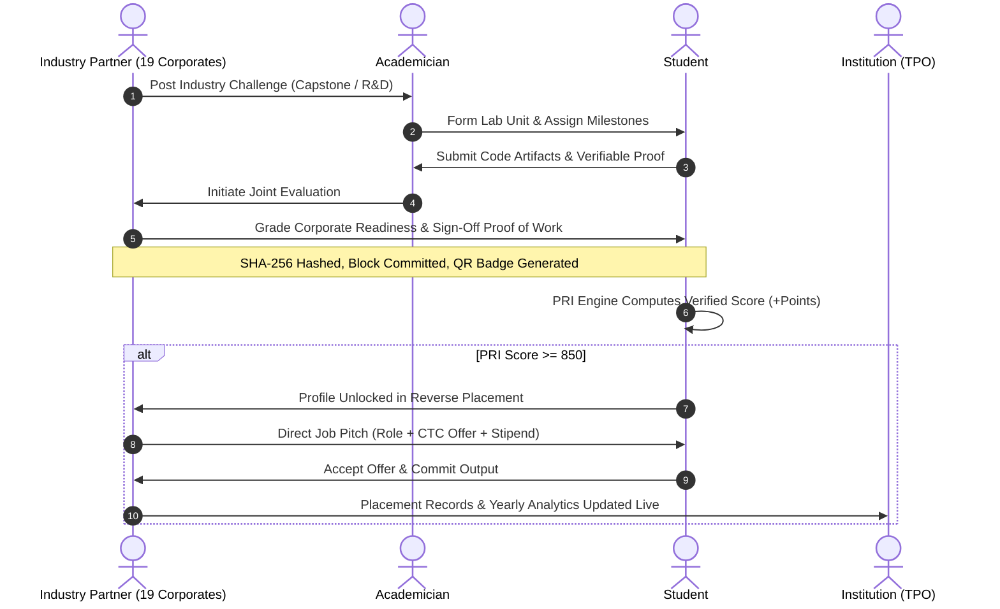

<div align="center">

# 🎓 SkillBridge
### **Next-Gen AI & Blockchain-Powered Academia–Industry Collaboration Ecosystem**

*Empowering Students, Faculty, Industry Leaders, and Academic Institutions through Verifiable Proof-of-Work, Joint Evaluation, AI Curriculum Modernization, and Reverse Campus Placement.*

---

[](https://www.sih.gov.in/)
[](https://nextjs.org/)
[](https://react.dev/)
[](https://www.typescriptlang.org/)
[](https://tailwindcss.com/)
[](https://www.prisma.io/)
[](https://ai.google.dev/)
[](https://www.npci.org.in/)

<br />

[⚡ Judge Quick Demo Guide](#-sih-evaluator--judge-quick-demo-guide) • [🚀 Key Innovations](#-breakthrough-innovations) • [🏛️ 4-Way Stakeholders](#-4-way-stakeholder-ecosystem) • [🏢 Corporate Partners](#-19-corporate-industry-partners-ecosystem) • [📊 Placement Portal](#-yearly-placement-analytics--corporate-matching) • [📐 Architecture](#-system-architecture) • [💻 Tech Stack](#-technical-stack) • [🛠️ Setup Guide](#-quick-start--installation)

---

</div>

<br />

## 🌟 Executive Summary & SIH Alignment

In India's higher education ecosystem, **over 80% of engineering graduates are deemed unemployable by industry**, while enterprises spend months and billions retraining fresh hires. Syllabi lag industry evolution by 3–5 years, student resumes suffer from rampant credential inflation, and academia remains fundamentally siloed from real-world enterprise demands.

**SkillBridge** directly bridges this divide. Aligned with the **National Education Policy (NEP 2020)**, **AICTE Industry-Academia Collaboration Guidelines**, and **Digital India**, SkillBridge establishes a frictionless, multi-tenant digital bridge connecting **Students**, **Academicians/Faculty**, **Industry Partners**, and **Educational Institutions (TPOs)**.

```
                    ┌─────────────────────────┐
                    │      SKILLBRIDGE        │
                    │   COLLABORATION PORTAL  │
                    └───────────┬─────────────┘
          ┌─────────────────────┼─────────────────────┐
          ▼                     ▼                     ▼
┌──────────────────┐  ┌──────────────────┐  ┌──────────────────┐
│     STUDENTS     │  │     FACULTY      │  │ 19+ ENTERPRISES  │
│ • Proof-of-Work  │  │ • Joint Eval     │  │ • Challenges     │
│ • Public Portf.  │  │ • Lab Units      │  │ • Reverse Hire   │
│ • Skill Decay    │  │ • AI Audit       │  │ • Mentor Clinics │
│ • PRI Score      │  │ • Sabbaticals    │  │ • e-RUPI Vouchers│
│ • Reverse Plcmt. │  │ • FDP Directory  │  │ • Live Pitches   │
└─────────┬────────┘  └─────────┬────────┘  └─────────┬────────┘
          └─────────────────────┼─────────────────────┘
                                ▼
                    ┌─────────────────────────┐
                    │      INSTITUTIONS       │
                    │ • Yearly Placement Stats│
                    │ • Skill Gap Heatmaps    │
                    │ • Accreditation Metrics │
                    │ • NAAC/NIRF Data Export │
                    └─────────────────────────┘
```

---

## 🚀 Breakthrough Innovations

### 1. 🎯 Placement Readiness Index (PRI Engine: 0 – 1000)
A dynamic, tamper-resistant composite score that replaces static CGPA with continuous, multidimensional evidence of real-world capability:
- **Skill Competency Score:** Up to 300 pts (Calibrated via diagnostic skill assessments)
- **Verified Projects Completed:** Up to 250 pts (Verified milestone deliveries)
- **Verifiable Proof of Work:** Up to 150 pts (Faculty + Enterprise dual cryptographic signatures)
- **Joint Evaluation Performance:** Up to 150 pts (Academic fundamentals + Corporate production readiness)
- **Mentorship & Office Hours:** Up to 100 pts (Active participation in 1:1 clinics)
- **Industry Challenge Solves:** Up to 50 pts (Micro-consultancies, capstones & hackathons)

### 2. 🔄 Reverse Campus Placement (Unlock at PRI ≥ 850)
Flips traditional campus hiring upside down. Students with **PRI ≥ 850** become discoverable in the **Reverse Placement Marketplace**, where verified corporate recruiters send personalized job pitches with stipend, role details, and compensation offers directly to top talent.

### 3. ⛓️ Cryptographic Proof of Work & Consortium Blockchain
- Every completed milestone undergoes a rigorous **Dual Sign-off Workflow** (Academic Advisor + Enterprise Mentor).
- Validated records are hashed with SHA-256 and committed into a simulated **Consortium Blockchain Ledger** (Block Hash, Merkle Root, Previous Hash, Validator Nodes).
- Generates **Public QR Badges** that recruiters can scan anywhere to independently verify authentic student output via the public verification endpoint (`/verify/[hash]`).

### 4. 📂 Public Verifiable Digital Portfolio & Document Vault (`/portfolio/[id]`)
- **Direct Recruiter Access:** Public, shareable profile link (`/portfolio/[userId]`) allowing recruiters to instantly inspect real pull requests, project architecture, and verified credentials.
- **Direct Resume View & Download:** Embedded resume and credential viewer with 1-click download options.
- **Dynamic Skill Radar:** Visualizes student mastery and temporal decay status in real time.

### 5. 🏢 19 Corporate Industry Partners Ecosystem (`/partners`)
- Interactive corporate directory featuring 19 multinational and indigenous enterprise partners including **Infosys, TCS, Wipro, Zoho, HCLTech, Google India, Microsoft India, Amazon AWS, NVIDIA India, Intel India, Samsung R&D, Tata Motors, Reliance Jio, and All India Institute of Ayurveda (AIIA)**.
- Live view of each corporate partner's active engineering challenges, learning programs, job pitches, and collaborative domains.
- **1-Click Login & Demo Switcher:** Seamlessly log in as any of the 19 enterprise partners to evaluate recruiter workflows.

### 6. 📊 Yearly Placement Analytics & Corporate Matching (`/placements`)
- Comprehensive placement dashboard tracking yearly cohort performance, placement percentage, highest/average packages (CTC), and department distribution.
- **Placement Records Management:** Create, edit, and manage student placement records tied to corporate partners.
- **Accreditation-Ready Exports:** 1-click Excel export via SheetJS for **NAAC (Criteria 1 & 2)**, **NBA**, and **NIRF** reporting.

### 7. 🧠 AI-Powered Syllabus Obsolescence Engine (`/syllabus`)
- Integrates pattern-matching heuristics and **Google Gemini 1.5 Flash LLM** to ingest university curricula.
- Automatically flags obsolete topics (e.g., SOAP/CORBA, legacy frameworks) against live industry job market requirements.
- Generates instant **Curriculum Patches & Micro-Modules** (e.g., gRPC, GraphQL, Event-Driven Streaming) for faculty boards of study.

### 8. ⚖️ Standardized Joint Evaluation Matrix (`/dual-grading`)
- Bridges academic rigor with industry standards through a dual-scoring model:
  - **Faculty:** Evaluates academic fundamentals (algorithms, documentation, discipline).
  - **Industry Mentors:** Evaluates enterprise readiness (production-level code, system design, test coverage, agility).
- Full role-based **edit and delete permissions** for faculty and industry evaluators with instant recalculation of student PRI.

### 9. 📝 Dynamic Skill Assessments & Adaptive Testing (`/assessments`)
- Skill diagnostics, aptitude tests, and technical tracks with **question skipping** and **flexible submission**.
- Automatically pinpoint strengths and upskill gaps into the student's verified skill graph.

### 10. 🏆 Industry Challenge & Capstone Marketplace (`/challenges`)
- Real-world engineering challenges, micro-consultancy gigs, and R&D sprints posted directly by corporate sponsors with clear stipends and deadlines.
- Role-based interaction: students apply with proposals and portfolio links; faculty review and form collaborative **Lab Units**; industry leads manage applicants and award contracts.

### 11. ⏳ Temporal Skill Decay Engine
- Recognizes that technology skills have a natural half-life.
- Tracks skills across **ACTIVE ➔ STALE ➔ EXPIRED** states.
- Incentivizes students to recertify, commit code, and attend mentorship clinics to keep their profile current.

### 12. 🎟️ Digital India e-RUPI Vouchers & Skill Token Economy
- **e-RUPI Vouchers:** Purpose-bound digital vouchers issued by corporate CSR/partners for certifications, lab equipment, and student training.
- **Skill Tokens:** Internal token ledger allowing students to book 15-minute 1:1 Office Hours and Code Clinics with verified industry mentors.

### 13. ⚡ High-Performance Glassmorphic UI & Split-Screen Experience
- Built for blazingly fast load times with Next.js Server Components and Tailwind CSS v4.
- Split-screen landing hero (**CAMPUS vs CORP**), ambient lighting, live ticker, and full dark/light theme support.

---

## 🏛️ 4-Way Stakeholder Ecosystem

| Stakeholder | Key Features & Capabilities | SIH Impact & Value |
|:---|:---|:---|
| **👨‍🎓 Student** | • Multi-factor PRI 0–1000 Engine<br>• Public Verifiable Portfolio (`/portfolio/[id]`)<br>• Clickable Resume View & Download<br>• Cryptographic Proof-of-Work with QR Badges<br>• Adaptive Skill Assessments with Question Skip<br>• Reverse Placement Job Pitches (PRI ≥ 850)<br>• 1:1 Mentor Clinics via Skill Tokens | Transforms passive learners into verified builders with immutable credentials and direct recruiter outreach. |
| **👩‍🏫 Academician** | • Faculty Portal & Industry Sabbatical Exchange<br>• AI Syllabus Obsolescence Audit & Patch Generator<br>• Lab Unit Incubator Management<br>• Joint Evaluation Console (Full Edit/Delete)<br>• AICTE-Recognized Faculty Development Programs (FDP) | Enables faculty to stay synchronized with industry trends and engage in paid consultancies and research. |
| **🏢 Industry Partner** | • 19 Seeded Corporate Partners with Rich Profiles<br>• Capstone & R&D Challenge Marketplace<br>• Reverse Placement Direct Candidate Outreach<br>• Joint Evaluation on Real-World Deliverables<br>• Mentor Slot Scheduling & 1:1 Code Clinics<br>• Purpose-Bound e-RUPI Education Vouchers | Cuts hiring turnaround time and retraining costs through verified talent pipelines and direct portfolio access. |
| **🏛️ Institution / TPO** | • Institutional Admin View & Analytics Dashboard<br>• Yearly Placement Records & CTC Salary Trends<br>• Department-Level Skill Gap Heatmaps<br>• NAAC, NBA, and NIRF Accreditation Exports (Excel)<br>• Corporate Partner Matching & MoUs Directory | Provides actionable macro insights to modernize curricula and achieve 100% verified placement success. |

---

## 📐 System Architecture

```mermaid
flowchart TB
    subgraph ClientLayer ["Client & Experience Layer (Next.js 16 + React 19)"]
        UI["Modern Responsive UI (Tailwind CSS v4 + Dark/Light Theme)"]
        SplitHero["Split Screen Landing Hero (Campus vs Corp)"]
        Switcher["Floating 1-Click Demo Switcher (All Personas + 19 Partners)"]
        RechartsComp["Analytics & Skill Heatmaps (Recharts)"]
        PublicPortfolio["Public Verifiable Portfolio & Direct Resume Viewer"]
    end

    subgraph SecurityLayer ["Identity & Security Gateway"]
        JWT["HttpOnly Cookie JWT Session"]
        Bcrypt["Bcrypt Password Hashing"]
        TOTP["2FA Two-Factor Authentication (otplib)"]
        RBAC["Role-Based Access Control (4 Stakeholders)"]
    end

    subgraph CoreEngines ["Domain & Logic Engines"]
        PRI["Placement Readiness Index (PRI Engine 0-1000)"]
        DecayEngine["Temporal Skill Decay Engine (Active/Stale/Expired)"]
        JointGrading["Joint Evaluation Matrix (Academic + Industry)"]
        AuditEngine["AI Syllabus Obsolescence Engine (Gemini 1.5 Flash)"]
        PlacementEngine["Yearly Placement Tracker & CTC Trends"]
        TokenLedger["Skill Token Economy & Office Hours Scheduler"]
        MatchEngine["Skill Match & Corporate Recommendation Algorithm"]
    end

    subgraph VerificationLayer ["Verification & Ledger Layer"]
        Blockchain["Consortium Blockchain (Merkle Root + SHA-256)"]
        QRGen["Public QR Proof Verification Badges"]
        Erupi["Purpose-Bound e-RUPI Vouchers"]
    end

    subgraph DataLayer ["Data & Persistence"]
        PrismaORM["Prisma ORM 6.x"]
        PostgresDB[("PostgreSQL / SQLite Database")]
    end

    UI --> SecurityLayer
    SecurityLayer --> CoreEngines
    CoreEngines --> VerificationLayer
    VerificationLayer --> DataLayer
    AuditEngine -.->|"Google Gemini API"| ExternalLLM["Google Gemini 1.5 Flash"]
```



---

## 🔄 End-to-End Workflow



---

## ⚡ SIH Evaluator & Judge Quick Demo Guide

For a fast evaluation during your judging rounds:

### 1. Instant 1-Click Floating Demo Switcher
SkillBridge features an integrated **Floating Demo Persona Switcher** at the **bottom-right corner** of the screen. Click on it to instantly switch between all four core roles without re-authenticating:
- **Student** (`Aarav Sharma`)
- **Academician** (`Dr. Rajesh Kumar`)
- **Institution / TPO** (`Dr. Lakshmi Narayanan`)
- **Industry Partners** (Quick switch across **Infosys** and **18 other top enterprises**!)

### 2. Pre-Seeded Test Credentials
All demo accounts are pre-configured with the default password: `PASSWORD@123`

| Persona | Role | Seeded Email | Key Areas to Evaluate |
|:---|:---|:---|:---|
| **Aarav Sharma** | `STUDENT` | `aarav.sharma@student.edu` | **PRI Breakdown (850+)**, Verifiable Proof-of-Work, Public Portfolio link, Resume View/Download, Skill Decay, Reverse Placement Pitches |
| **Dr. Rajesh Kumar** | `ACADEMICIAN` | `rajesh.kumar@faculty.edu` | **AI Syllabus Obsolescence Audit**, Joint Evaluation Console (edit/delete), Lab Units, Sabbatical Listings |
| **Infosys Campus Lead** | `INDUSTRY` | `recruit@infosys.com` | **Post Challenges**, Reverse Placement Direct Pitches, Candidate Portfolio inspection, Joint Evaluation sign-off |
| **Dr. Lakshmi Narayanan** | `INSTITUTION` | `tpo@university.edu` | **Yearly Placement Analytics**, Placement Record Management, Skill Gap Heatmaps, NAAC/NIRF Excel Export |

### 3. 1-Click Login for All 19 Industry Corporate Partners
On the [Login Page](/login), expand the **"Corporate & Enterprise Partners (19)"** accordion to log in with a single click as **Infosys, TCS, Wipro, Zoho, HCLTech, Google India, Microsoft India, Amazon AWS, NVIDIA India, Intel India, AIIA, Samsung R&D, Tata Motors, Reliance Jio**, and more!

### 4. Suggested 3-Minute Hackathon Evaluation Flow
1. **Landing Page:** Explore the responsive Split Screen Hero (**Campus vs Corp**), live data ticker, and feature highlights.
2. **Student Dashboard:** View Aarav Sharma's **Placement Readiness Index (PRI: 850+)**, inspect verified proof-of-work badges, and open the **Public Verifiable Portfolio** to test resume view/download.
3. **AI Syllabus Audit:** Switch to **Dr. Rajesh Kumar** (`ACADEMICIAN`), navigate to **Syllabus**, and trigger the AI audit to see obsolete topics flagged and curriculum patches recommended.
4. **Joint Evaluation Console:** Navigate to **Joint Evaluation**, inspect academic and enterprise grading criteria, and test editing or deleting evaluation records.
5. **Reverse Placement & Challenges:** Switch to **Infosys** (`INDUSTRY`), inspect top students unlocked at PRI ≥ 850, dispatch a tailored Job Pitch, or post an engineering challenge.
6. **Placements & Heatmaps:** Switch to **Dr. Lakshmi Narayanan** (`INSTITUTION`), review yearly placement trends, add a placement record, and inspect department skill gap heatmaps.

---

## 💻 Technical Stack

### Frontend & Visual Architecture
- **Framework:** Next.js 16 (App Router with Server Components & Server Actions)
- **UI Runtime:** React 19 + TypeScript 5
- **Styling:** Tailwind CSS v4 + Modular CSS Design System
- **Icons & Theme:** Lucide React + `next-themes` (Seamless Dark/Light Mode)
- **Data Visualization:** Recharts (Radar, Area, Bar, and Gauge charts)

### Backend, Database & Ledger
- **Runtime:** Node.js (Edge-compatible server actions)
- **ORM:** Prisma Client 6.x (Multi-dialect: PostgreSQL in production, SQLite locally)
- **Security:** JWT (HttpOnly, Secure Cookies) + BcryptJS password hashing
- **Two-Factor Auth:** Time-based One-Time Passwords (`otplib` + QR verification)
- **Blockchain Simulation:** Merkle Tree root hashing, SHA-256 block header chaining, and validation consensus
- **QR Code Engine:** `qrcode` SVG generator for cryptographic credential verification
- **Spreadsheets:** SheetJS (`xlsx`) for institutional accreditation exports

### AI & External Services
- **AI Model:** Google Gemini 1.5 Flash (via `@google/genai` / REST integration with resilient heuristics fallback)
- **Email Delivery:** Nodemailer with responsive HTML templates

---

## 🛠️ Quick Start & Installation

### Prerequisites
- Node.js 18.x or 20.x installed
- Git

### 1. Clone & Install Dependencies
```bash
git clone https://github.com/Phantom-Coders-Team/SkillBridge.git
cd SkillBridge
npm install
```

### 2. Configure Environment Variables
Create a `.env` file in the root directory:
```env
# Database (PostgreSQL or SQLite)
DATABASE_URL="file:./dev.db"

# Authentication
JWT_SECRET="super-secret-jwt-key-for-skillbridge-hackathon"
NEXT_PUBLIC_BASE_URL="http://localhost:3000"

# Optional: Google Gemini API for Real-Time AI Syllabus Audit
GEMINI_API_KEY="your-google-gemini-api-key"

# Optional: Email Service (SMTP)
SMTP_HOST="smtp.gmail.com"
SMTP_PORT="587"
SMTP_USER="your-email@gmail.com"
SMTP_PASS="your-app-password"
```

### 3. Initialize Database & Seed Demo Data
```bash
# Push schema to database
npx prisma db push

# Seed comprehensive SIH demo personas, 19 industry partners, challenges, and proofs of work
npm run db:seed
```

### 4. Run Development Server
```bash
npm run dev
```
Open [http://localhost:3000](http://localhost:3000) in your browser.

---

## 📁 Repository Structure

```
SkillBridge/
├── prisma/
│   ├── schema.prisma            # 25+ relational models (Users, PRI, Blockchain, e-RUPI, Placements, etc.)
│   └── seed.ts                  # Pre-seeded SIH personas, 19 corporate partners, and real-world scenario data
├── public/                      # Static assets, logos, and badges
├── src/
│   ├── app/
│   │   ├── (app)/               # Authenticated stakeholder application routes
│   │   │   ├── dashboard/       # Unified stakeholder-aware dashboard
│   │   │   ├── assessments/     # Adaptive skill diagnostics with skip functionality
│   │   │   ├── analytics/       # Institutional admin view & aggregate data
│   │   │   ├── pri/             # Placement Readiness Index deep-dive & breakdown
│   │   │   ├── proof-of-work/   # Verifiable project proofs & blockchain explorer
│   │   │   ├── portfolio/       # Public verifiable digital portfolio & resume vault
│   │   │   ├── reverse-placement/# Reverse hiring marketplace (PRI ≥ 850)
│   │   │   ├── placements/      # Yearly placement analytics, CTC trends & records
│   │   │   ├── partners/        # 19 Corporate Enterprise Partners directory
│   │   │   ├── syllabus/        # AI-driven syllabus obsolescence audit
│   │   │   ├── dual-grading/    # Joint Evaluation console (Faculty + Industry)
│   │   │   ├── challenges/      # Industry challenges & capstone marketplace
│   │   │   ├── lab-units/       # Faculty-led incubator teams
│   │   │   ├── heatmap/         # Institutional department skill gap analytics
│   │   │   ├── office-hours/    # 1:1 mentor booking via skill tokens
│   │   │   ├── mentor-slots/    # Mentor availability management
│   │   │   ├── sabbaticals/     # Faculty industrial training & consultancy
│   │   │   ├── internships/     # Internship opportunities & applications
│   │   │   ├── job-pitches/     # Corporate candidate outreach tracker
│   │   │   └── settings/        # 2FA security, notifications, and profile
│   │   ├── api/                 # API endpoints (demo switcher, syllabus, PRI, auth)
│   │   ├── login/               # Role-aware authentication with 1-click partner logins
│   │   ├── signup/              # Multi-tenant onboarding
│   │   ├── verify/              # Public QR cryptographic proof verification
│   │   └── page.tsx             # Split-screen responsive landing page
│   ├── components/              # Modular UI components, demo switcher, and charts
│   └── lib/                     # PRI calculation, blockchain logic, auth, AI audit
├── package.json
└── README.md
```

---

## 🌍 National Impact & Future Roadmap

```
  [Stage 1: SIH Prototype] ➔ [Stage 2: State Pilot] ➔ [Stage 3: National Rollout]
   • 4 Stakeholders          • 25 Universities        • AICTE/NATS Integration
   • PRI 0-1000 Engine       • Real e-RUPI Banking    • Decentralized DID Credentials
   • Simulated Blockchain    • 100+ Enterprise MoUs   • Millions of Empowered Youth
```

- **NEP 2020 Compliance:** Implements multidisciplinary learning, mandatory internships, and continuous credit bank integration.
- **Accreditation Readiness:** Generates instant audit trails and Excel exports for NAAC Criteria 1 (Curricular Aspects) and Criteria 2 (Teaching-Learning).
- **Decentralized Verification:** Planned transition from consortium simulation to Hyperledger / Polygon ID for decentralized student digital credentials (W3C DID).

---

## 👥 The SkillBridge Team
Developed with passion by **Phantom-Coders-Team** for **Smart India Hackathon (SIH)**.

*Empowering the next generation of engineers, educators, and enterprise leaders.*
