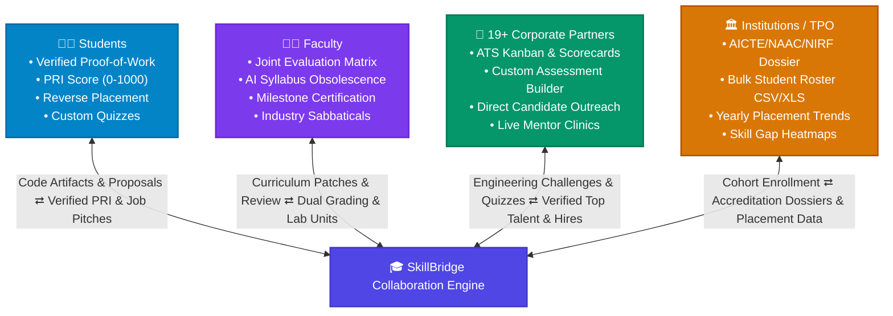
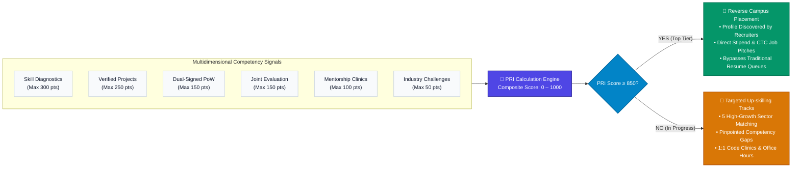
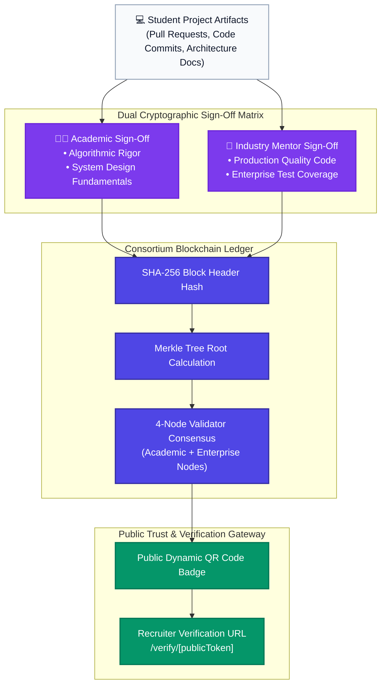
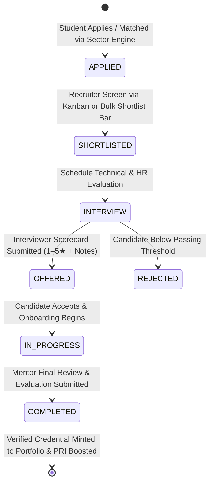
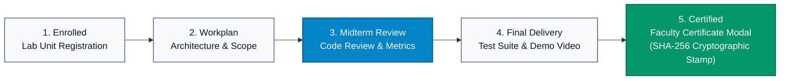
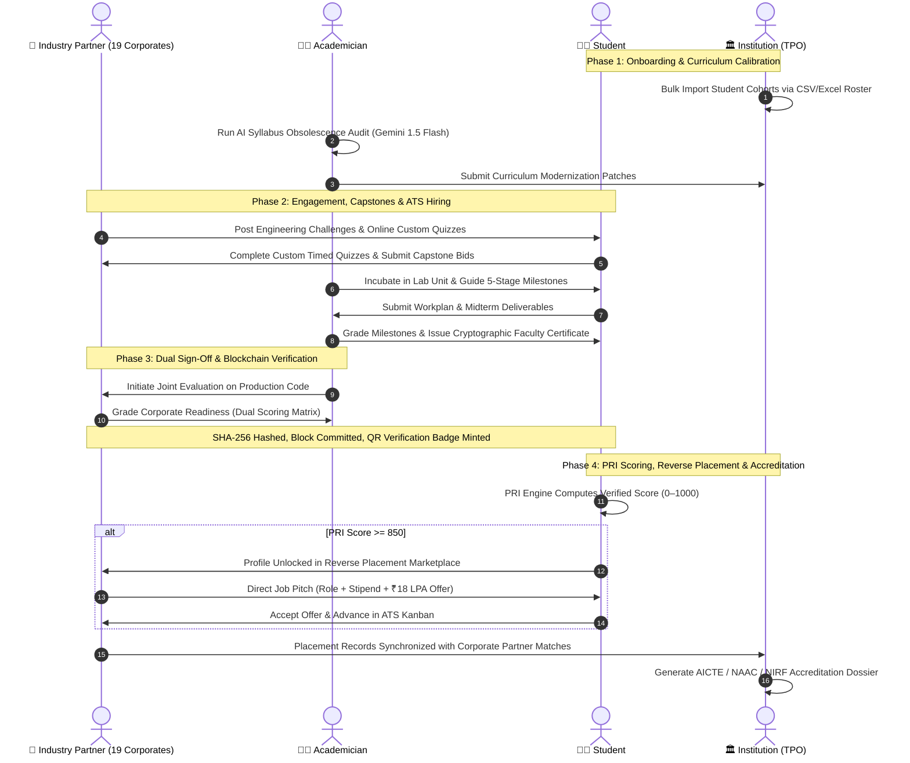
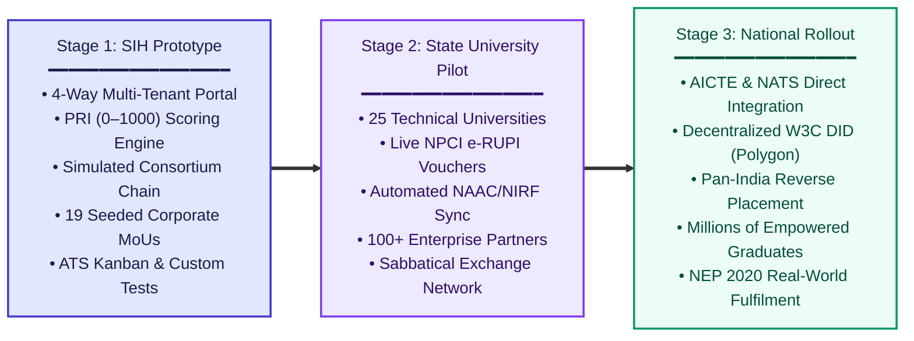

<div align="center">

# 🎓 SkillBridge
### **Next-Gen AI & Blockchain-Powered Academia–Industry Collaboration Ecosystem**

*Empowering Students, Faculty, Industry Leaders, and Academic Institutions through Verifiable Proof-of-Work, Joint Evaluation, AI Curriculum Modernization, ATS Kanban Pipelines, Custom Assessments, and Reverse Campus Placement.*

---

[](https://www.sih.gov.in/)
[](https://nextjs.org/)
[](https://react.dev/)
[](https://www.typescriptlang.org/)
[](https://tailwindcss.com/)
[](https://www.prisma.io/)
[](https://ai.google.dev/)
[](#3-️-cryptographic-proof-of-work--consortium-blockchain)
[](https://www.npci.org.in/)

<br />

[⚡ Judge Quick Demo Guide](#-sih-evaluator--judge-quick-demo-guide) • [🚀 Key Innovations](#-breakthrough-innovations) • [🏛️ 4-Way Stakeholders](#-4-way-stakeholder-ecosystem) • [🏢 Corporate Partners](#-19-corporate-industry-partners-ecosystem) • [📊 Placement Portal](#-yearly-placement-analytics--corporate-matching) • [📐 Architecture](#-system-architecture) • [💻 Tech Stack](#-technical-stack) • [🛠️ Setup Guide](#-quick-start--installation)

---

</div>

<br />

## 🌟 Executive Summary & SIH Alignment

In India's higher education ecosystem, **over 80% of engineering graduates are deemed unemployable by industry**, while enterprises spend months and billions retraining fresh hires. Syllabi lag industry evolution by 3–5 years, student resumes suffer from rampant credential inflation, and academia remains fundamentally siloed from real-world enterprise demands.

**SkillBridge** directly bridges this divide. Aligned with the **National Education Policy (NEP 2020)**, **AICTE Industry-Academia Collaboration Guidelines**, and **Digital India**, SkillBridge establishes a frictionless, multi-tenant digital bridge connecting **Students**, **Academicians/Faculty**, **Industry Partners**, and **Educational Institutions (TPOs)**.



---

## 🚀 Breakthrough Innovations

### 1. 🎯 Placement Readiness Index (PRI Engine: 0 – 1000)
A dynamic, tamper-resistant composite score that replaces static CGPA with continuous, multidimensional evidence of real-world capability:
- **Skill Competency Score:** Up to 300 pts (Calibrated via diagnostic skill assessments)
- **Verified Projects Completed:** Up to 250 pts (Verified milestone deliveries)
- **Verifiable Proof of Work:** Up to 150 pts (Faculty + Enterprise dual cryptographic signatures)
- **Joint Evaluation Performance:** Up to 150 pts (Academic fundamentals + Corporate production readiness)
- **Mentorship & Office Hours:** Up to 100 pts (Active participation in 1:1 clinics)
- **Industry Challenge Solves:** Up to 50 pts (Micro-consultancies, capstones & hackathons)



### 2. 🔄 Reverse Campus Placement (Unlock at PRI ≥ 850)
Flips traditional campus hiring upside down. Students with **PRI ≥ 850** become discoverable in the **Reverse Placement Marketplace**, where verified corporate recruiters send personalized job pitches with stipend, role details, and compensation offers directly to top talent.

### 3. ⛓️ Cryptographic Proof of Work & Consortium Blockchain
- Every completed milestone undergoes a rigorous **Dual Sign-off Workflow** (Academic Advisor + Enterprise Mentor).
- Validated records are hashed with SHA-256 and committed into a simulated **Consortium Blockchain Ledger** (Block Hash, Merkle Root, Previous Hash, Validator Nodes).
- Generates **Public QR Badges** that recruiters can scan anywhere to independently verify authentic student output via the public verification endpoint (`/verify/[hash]`).



### 4. 📂 Public Verifiable Digital Portfolio & Document Vault (`/portfolio/[id]`)
- **Direct Recruiter Access:** Public, shareable profile link (`/portfolio/[userId]`) allowing recruiters to instantly inspect real pull requests, project architecture, and verified credentials.
- **4-Way Secure Document Management:** Dedicated storage, instant filtering, and in-browser preview/download for all four national standard document categories:
  1. `Resumes & CVs`
  2. `Professional Certifications (Courses & Hackathons)`
  3. `Internship Reports & Industrial Completion Records`
  4. `Academic Records, Marksheets & Official Transcripts`
- **Cryptographic Tamper-Proof Badges:** Every document is hashed and tagged with a verified cryptographic integrity badge (`ShieldCheck`).
- **Dynamic Skill Radar:** Visualizes student mastery and temporal decay status in real time.

### 5. 🎯 Intelligent Skill Mapping & Career Guidance Engine (`/skills`)
- **Automated Competency Profiling:** Diagnoses verified student skills against live enterprise requirements:
  - **Validated Industry Strengths (Score ≥ 70%):** Production-ready capabilities.
  - **Identified Skill Gaps (Score < 70%):** Pinpoints competencies requiring calibration and project experience.
- **Dynamic Industry Sector Matching:** Calculates real-time match percentages across five high-growth sectors:
  1. *Enterprise Cloud & DevOps* (Amazon AWS, Microsoft, HCLTech)
  2. *Generative AI & Data Intelligence* (Google India, NVIDIA, Intel, Samsung R&D)
  3. *Full Stack & SaaS Product Engineering* (Zoho, Wipro, TCS, Jio)
  4. *Embedded Systems & Smart Mobility* (Tata Motors, Samsung)
  5. *Cybersecurity & FinTech Architecture* (Wipro, TCS, Infosys)
- **Target Career Roles & Guidance:** Recommends roles (*Full Stack Cloud Engineer, AI Solutions Architect, etc.*) with salary bands (₹16–30 LPA), demand tiers, and required core competency checklists.
- **Curated Up-skilling Tracks:** Bridges skill gaps via direct 1-click enrollment into corporate partner training programs.

### 6. 📋 Recruiter ATS Kanban Board, Bulk Shortlisting & Interviewer Scorecards (`/internships`)
- **Complete End-to-End Pipeline:** Seamlessly guides candidates across all six stages:
  `Applied ➔ Shortlisted ➔ Interview ➔ Offered ➔ In Progress ➔ Completed`.
- **Interactive Kanban ATS Board:** Visual stage columns with instant drag/advance actions, candidate match badges, and real-time status updates.
- **Multi-Candidate Bulk Shortlist Bar:** Checkbox multi-select allowing enterprise recruiters to bulk shortlist candidates or bulk advance applicants to the interview stage with one click.
- **Interviewer Scorecard Modal:** Corporate interviewers record structured quantitative scores (1–5 stars) and qualitative evaluation notes directly on the candidate's application record.
- **Automated Digital Credential Minting:** Marking an internship as completed automatically mints an authenticated, verified credential directly onto the student's **Digital Portfolio** (`/portfolio`), immediately boosting their **Placement Readiness Index (PRI)**.



### 7. 🧪 Industry Custom Assessment Builder & Timed Student Quizzes (`/assessments`)
- **Corporate Assessment Creator:** Enterprise partners can author bespoke online screening quizzes, defining title, category (Technical, Soft Skills, Aptitude), primary skill, duration in minutes, passing threshold, and multiple-choice questions with answer keys and explanations.
- **Student Interactive Custom Quiz Modal:** Students take company-sponsored assessments with a real-time countdown timer, progress indicators, question skipping, instant scoring, answer explanations, and automated submission persistence.
- **Direct Skill Graph Integration:** Passing custom assessments unlocks skill endorsements and adds verified credit toward student PRI calculations.

### 8. 🎓 Faculty Milestone Tracker & Cryptographic Certification (`/faculty-portal`)
- **Structured 5-Stage Project Progression:** Tracks faculty-guided student research, capstones, and industrial training across 5 formal milestones:
  `1. Enrolled ➔ 2. Workplan Submitted ➔ 3. Midterm Review ➔ 4. Final Delivery ➔ 5. Certified`.
- **Dual Deliverable Review:** Students submit workplan and final report links with repository artifacts; faculty evaluate progress with qualitative feedback and star ratings.
- **Faculty Certificate Modal:** Faculty issue tamper-evident completion certificates with cryptographic SHA-256 integrity hashes, committing official academic endorsements directly to the student's verifiable profile.



### 9. 👥 Institutional Bulk Student Roster Importer (`/analytics`)
- **CSV / Excel Drag-and-Drop Ingestion:** University TPOs and administrators can bulk onboard entire student cohorts in seconds.
- **Live Client-Side Parsing & Validation:** Instant preview of parsed records (Name, Email, Roll Number, Department, Year, Skills) with duplicate detection and missing field flags.
- **1-Click Batch Account Provisioning:** Automatically provisions student user accounts, attaches departmental profiles, and seeds starter skill graphs with rollback safeguards.

### 10. 📑 AICTE / NAAC / NIRF Institutional Accreditation Dossier (`/analytics`)
- **Automated Compliance Dossier Generator:** Aggregates real-time institutional metrics into a standardized, audit-ready compliance document.
- **Key Accreditation Mappings:**
  - **NAAC Criteria 1 & 2:** Curricular relevance, industry syllabus audits, and experiential project work.
  - **NAAC Criteria 5 & NIRF Placement:** Verified placement percentages, median CTC, highest packages, and corporate recruiter rosters.
  - **AICTE & NIRF Research Metrics:** Active faculty industrial sabbaticals, collaborative lab units, and enterprise MoUs.
- **Print & Export Ready:** Features a dedicated, styled print layout and instant 1-click Excel export via SheetJS (`xlsx`).

### 11. 🤝 In-Browser Interactive Mentorship & Code Clinic Workspace (`/mentor-slots`)
- **Unified Collaboration Suite:** Integrated directly into booked 1:1 mentor sessions.
- **Live Code Review Canvas:** Real-time TypeScript/Python/SQL code review editor with syntax styling and 1-click code copying.
- **Session Agenda Checklist:** Interactive checklist covering *Architecture Review*, *Code Profiling*, and *Skill Guidance*.
- **Collaborative Notes & Action Items:** Shared notes saved for institutional NEP 2020 and NIRF industrial exposure compliance.
- **Integrated WebRTC Video Bridge:** One-click toggle between the Code Review workspace and embedded video conference.

### 12. 🏢 19 Corporate Industry Partners Ecosystem (`/partners`)
- Interactive corporate directory featuring 19 multinational and indigenous enterprise partners:
  **Google India, Microsoft India, Amazon AWS, NVIDIA India, Intel India, Cisco Systems, IBM India Research, Oracle India, TCS, Infosys, Wipro, Zoho, HCLTech, L&T Technology Services, Tech Mahindra, Samsung R&D, Tata Motors, Reliance Jio, and All India Institute of Ayurveda (AIIA)**.
- Live view of each corporate partner's active engineering challenges, learning programs, job pitches, and collaborative domains.
- **1-Click Login & Demo Switcher:** Seamlessly log in as any of the 19 enterprise partners to evaluate recruiter workflows.

### 13. 📊 Yearly Placement Analytics & Corporate Matching (`/placements`)
- Comprehensive placement dashboard tracking 5-year cohort performance, placement percentage, highest/average packages (CTC), and department distribution.
- **Category Classification:** Categorizes offers into *Super Dream* (₹20+ LPA), *Dream* (₹10–20 LPA), *Core R&D*, and *IT Services*.
- **Corporate Matching Engine:** Matches campus placement records against verified SkillBridge corporate partners with badge highlights.
- **Accreditation-Ready Exports:** 1-click Excel export via SheetJS for **NAAC**, **NBA**, and **NIRF** reporting.

### 14. 🧠 AI-Powered Syllabus Obsolescence Engine (`/syllabus`)
- Integrates pattern-matching heuristics and **Google Gemini 1.5 Flash LLM** to ingest university curricula.
- Automatically flags obsolete topics (e.g., SOAP/CORBA, legacy frameworks) against live industry job market requirements.
- Generates instant **Curriculum Patches & Micro-Modules** (e.g., gRPC, GraphQL, Event-Driven Streaming) for faculty boards of study.

### 15. ⚖️ Standardized Joint Evaluation Matrix (`/dual-grading`)
- Bridges academic rigor with industry standards through a dual-scoring model:
  - **Faculty:** Evaluates academic fundamentals (algorithms, documentation, discipline).
  - **Industry Mentors:** Evaluates enterprise readiness (production-level code, system design, test coverage, agility).
- Full role-based **edit and delete permissions** for faculty and industry evaluators with instant recalculation of student PRI.

### 16. ⏳ Temporal Skill Decay Engine
- Recognizes that technology skills have a natural half-life.
- Tracks skills across **ACTIVE ➔ STALE ➔ EXPIRED** states.
- Incentivizes students to recertify, commit code, and attend mentorship clinics to keep their profile current.

### 17. 🎟️ Digital India e-RUPI Vouchers & Skill Token Economy (`/tokens`)
- **e-RUPI Vouchers:** Purpose-bound digital vouchers issued by corporate CSR/partners for certifications, lab equipment, and student training.
- **Skill Tokens:** Internal token ledger allowing students to book 15-minute 1:1 Office Hours and Code Clinics with verified industry mentors.

### 18. 🛡️ Enterprise Security, Password Policy & TOTP 2FA (`/settings`, `/login`)
- **Real-Time Password Complexity Engine:** Enforces minimum 8 characters, uppercase, lowercase, numbers, special characters, and email prefix collision checks with dynamic visual strength meters.
- **Two-Factor Authentication (TOTP):** Time-based one-time password security via `otplib` with SVG QR code generation and 8 cryptographically hashed emergency backup codes.
- **Secure Sessions:** HttpOnly cookie-based JWT authentication with strict Role-Based Access Control (RBAC).

---

## 🏛️ 4-Way Stakeholder Ecosystem

| Stakeholder | Key Features & Capabilities | SIH Impact & Value |
|:---|:---|:---|
| **👨‍🎓 Student** | • Multi-factor PRI 0–1000 Engine<br>• **Skill Mapping & Career Guidance Hub** (`/skills`)<br>• **6-Stage Internship Pipeline** & Status Tracking<br>• **Custom Company Screening Quizzes** (`/assessments`)<br>• Public Verifiable Portfolio (`/portfolio/[id]`)<br>• **4-Way Secure Document Vault** with SHA-256 badges<br>• Reverse Placement Job Pitches (PRI ≥ 850)<br>• 1:1 Live Collaboration Clinic & WebRTC Meeting | Transforms passive learners into verified builders with immutable credentials and direct recruiter outreach. |
| **👩‍🏫 Academician** | • **Faculty Milestone Tracker** & Progress Grading<br>• **Tamper-Evident Faculty Certificates** (`FacultyCertificateModal`)<br>• AI Syllabus Obsolescence Audit & Patch Generator<br>• Lab Unit Incubator Management<br>• Joint Evaluation Console (Full Edit/Delete)<br>• AICTE-Recognized Faculty Development Programs (FDP) | Enables faculty to stay synchronized with industry trends, guide verified research capstones, and lead industry consultancies. |
| **🏢 Industry Partner** | • **ATS Kanban Board** for candidate management<br>• **Multi-Candidate Bulk Shortlisting Bar**<br>• **Interviewer Scorecard Modal** (1–5 Stars + Notes)<br>• **Custom Assessment Builder** (Bespoke online screening)<br>• 19 Seeded Corporate Partners with Rich Profiles<br>• Capstone & R&D Challenge Marketplace<br>• Reverse Placement Direct Outreach & e-RUPI Vouchers | Cuts hiring turnaround time and retraining costs through verified talent pipelines, automated ATS tooling, and direct portfolio access. |
| **🏛️ Institution / TPO** | • **AICTE / NAAC / NIRF Accreditation Dossier Generator**<br>• **Bulk Student Roster Importer** (CSV & Excel Drag/Drop)<br>• Yearly Placement Records & CTC Salary Trends<br>• Department-Level Skill Gap Heatmaps<br>• 1-Click Accreditation Excel Exports via SheetJS<br>• Corporate Partner Matching & MoUs Directory | Provides actionable macro insights to modernize curricula, automate administrative onboarding, and achieve 100% verified placement success. |

---

## 📐 System Architecture

```mermaid
flowchart TB
    classDef client fill:#f1f5f9,stroke:#0284c7,stroke-width:2px,color:#0f172a;
    classDef sec fill:#e0e7ff,stroke:#4338ca,stroke-width:2px,color:#1e1b4b;
    classDef core fill:#ede9fe,stroke:#7c3aed,stroke-width:2px,color:#2e1065;
    classDef ledger fill:#ecfdf5,stroke:#059669,stroke-width:2px,color:#064e3b;
    classDef data fill:#fef3c7,stroke:#d97706,stroke-width:2px,color:#78350f;
    classDef ext fill:#fee2e2,stroke:#dc2626,stroke-width:2px,color:#7f1d1d;

    subgraph ClientLayer ["Client & Visual Experience Layer (Next.js 16 + React 19 + Tailwind v4)"]
        UI["Modern Glassmorphic Shell & Theme Toggle"]:::client
        SplitHero["Split-Screen Landing Hero (Campus vs Corp)"]:::client
        DemoSwitch["Floating 1-Click Demo Persona Switcher"]:::client
        AtsBoard["Recruiter ATS Kanban Board & Scorecard Modal (/internships)"]:::client
        CustomQuiz["Custom Assessment Builder & Quiz Runner (/assessments)"]:::client
        FacultyTrack["Faculty Milestone Tracker & Certificate Modal (/faculty-portal)"]:::client
        RosterImport["Institutional Bulk Student Roster Importer (/analytics)"]:::client
        AccredDoc["AICTE / NAAC / NIRF Accreditation Dossier (/analytics)"]:::client
        CollabClinic["Live Mentorship & Code Clinic Workspace (/mentor-slots)"]:::client
        DocVault["4-Way Cryptographic Document Vault (/portfolio)"]:::client
        PublicPort["Public Verifiable Portfolio & QR Badges (/portfolio/[userId])"]:::client
    end

    subgraph SecurityGateway ["Identity & Security Gateway"]
        AuthJWT["HttpOnly Cookie JWT Session Gateway"]:::sec
        PassSec["Password Policy & Complexity Criteria Meter"]:::sec
        TwoFA["TOTP Two-Factor Authentication & 8 Backup Codes"]:::sec
        RBAC["Role-Based Access Control (4 Personas)"]:::sec
    end

    subgraph DomainEngines ["Core Domain & Intelligence Engines"]
        PRI["Placement Readiness Index (PRI Engine: 0–1000)"]:::core
        CareerEngine["Skill Mapping & 5 Industry Sector Matching Algorithm"]:::core
        AtsEngine["ATS Candidate Progression & Match Scoring Engine"]:::core
        DecayEngine["Temporal Skill Decay Engine (Active / Stale / Expired)"]:::core
        JointGrading["Standardized Joint Evaluation Matrix (Dual Grading)"]:::core
        AuditEngine["AI Syllabus Obsolescence Engine"]:::core
        PlacementEngine["Yearly Placement Tracker & Corporate Matching Engine"]:::core
        TokenLedger["Skill Token Economy & e-RUPI Voucher Controller"]:::core
    end

    subgraph TrustLedger ["Verification & Consortium Blockchain Layer"]
        Consortium["Consortium Blockchain Simulator (Merkle Tree + SHA-256)"]:::ledger
        QRGen["Public QR Verification Badge Generator (/verify/[token])"]:::ledger
        ErupiVouchers["Digital India e-RUPI Purpose-Bound Vouchers"]:::ledger
    end

    subgraph PersistenceLayer ["Data & Persistence Layer"]
        PrismaORM["Prisma ORM 6.x (Multi-Engine)"]:::data
        Database[("PostgreSQL / SQLite Database")]:::data
    end

    subgraph ExternalServices ["External Intelligence & Cloud Integrations"]
        GeminiLLM["Google Gemini 1.5 Flash LLM API"]:::ext
        SMTP["Nodemailer Enterprise Email Delivery"]:::ext
    end

    %% Client to Security
    UI & AtsBoard & CustomQuiz & FacultyTrack & RosterImport & AccredDoc & DocVault --> AuthJWT
    AuthJWT --> PassSec & TwoFA & RBAC

    %% Security to Domain Engines
    RBAC --> PRI & CareerEngine & AtsEngine & DecayEngine & JointGrading & AuditEngine & PlacementEngine & TokenLedger

    %% Specific Functional Linkages
    CustomQuiz & AtsBoard --> AtsEngine
    FacultyTrack & JointGrading --> JointGrading
    FacultyTrack --> Consortium
    AuditEngine -.->|"Curriculum Analysis"| GeminiLLM
    AuditEngine --> JointGrading

    %% Domain to Ledger
    JointGrading & PRI --> Consortium
    Consortium --> QRGen
    TokenLedger --> ErupiVouchers

    %% Domain & Ledger to Persistence
    PRI & AtsEngine & JointGrading & PlacementEngine & TokenLedger --> PrismaORM
    Consortium --> PrismaORM
    PrismaORM --> Database
```



---

## 🔄 End-to-End Workflow



---

## ⚡ SIH Evaluator & Judge Quick Demo Guide

For a fast evaluation during your judging rounds:

### 1. Instant 1-Click Floating Demo Switcher
SkillBridge features an integrated **Floating Demo Persona Switcher** at the **bottom-right corner** of the screen. Click on it to instantly switch between all four core roles without re-authenticating:
- **Student** (`Aarav Sharma`)
- **Academician** (`Dr. Rajesh Kumar`)
- **Institution / TPO** (`Dr. Lakshmi Narayanan`)
- **Industry Partners** (Quick switch across **Infosys** and **18 other top enterprises**!)

### 2. Pre-Seeded Test Credentials
All demo accounts are pre-configured with the default password: `PASSWORD@123`

| Persona | Role | Seeded Email | Key Areas to Evaluate |
|:---|:---|:---|:---|
| **Aarav Sharma** | `STUDENT` | `aarav.sharma@student.edu` | **PRI Breakdown (850+)**, Verifiable Proof-of-Work, Public Portfolio link, Resume View/Download, Custom Quizzes, Skill Decay, Reverse Placement Pitches |
| **Dr. Rajesh Kumar** | `ACADEMICIAN` | `rajesh.kumar@faculty.edu` | **Faculty Milestone Tracker**, Tamper-Evident Faculty Certificates, **AI Syllabus Obsolescence Audit**, Joint Evaluation Console (edit/delete), Lab Units, Sabbaticals |
| **Infosys Campus Lead** | `INDUSTRY` | `recruit@infosys.com` | **ATS Kanban Board**, Bulk Shortlisting, Interviewer Scorecards, **Custom Assessment Builder**, Reverse Placement Direct Pitches, Joint Evaluation sign-off |
| **Dr. Lakshmi Narayanan** | `INSTITUTION` | `tpo@university.edu` | **Bulk Student Roster Importer** (CSV/Excel), **AICTE/NAAC/NIRF Dossier Generator**, Yearly Placement Analytics, Skill Gap Heatmaps, NAAC/NIRF Excel Export |

### 3. 1-Click Login for All 19 Industry Corporate Partners
On the [Login Page](/login), expand the **"Corporate & Enterprise Partners (19)"** accordion to log in with a single click as **Infosys, TCS, Wipro, Zoho, HCLTech, Google India, Microsoft India, Amazon AWS, NVIDIA India, Intel India, Cisco Systems, IBM India, Oracle India, LTIMindtree, Tech Mahindra, AIIA, Samsung R&D, Tata Motors, Reliance Jio**, and more!

### 4. Suggested 3-Minute Hackathon Evaluation Flow
1. **Landing Page:** Explore the responsive Split Screen Hero (**Campus vs Corp**), live data ticker, and feature highlights.
2. **Skill Mapping & Career Guidance:** As **Aarav Sharma** (`STUDENT`), navigate to **Skills** to inspect the automated **Strengths vs. Skill Gaps Matrix**, **Industry Sector Matches** across 5 verticals, and targeted **Up-skilling Tracks**.
3. **Public Portfolio & Document Vault:** Open the **Digital Portfolio** (`/portfolio`), test document filtering (Resumes, Certificates, Reports, Transcripts), view cryptographic **Tamper-Proof Badges**, and preview verified proof-of-work badges.
4. **Recruiter ATS Kanban & Custom Assessments:** Switch to **Infosys** (`INDUSTRY`), open **Internships** to test the **ATS Kanban Board**, drag/advance candidates, use the **Bulk Shortlist Bar**, and open an **Interviewer Scorecard**. Then navigate to **Assessments** and test the **Industry Assessment Builder**.
5. **Faculty Milestone Tracker & Certification:** Switch to **Dr. Rajesh Kumar** (`ACADEMICIAN`), navigate to **Faculty Portal**, review student milestone progress (Workplan ➔ Midterm ➔ Final Delivery), and click **Issue Faculty Certificate** to mint a cryptographic credential.
6. **AI Syllabus Audit:** In **Faculty Portal** or via **Syllabus**, trigger the AI audit to see obsolete topics flagged and modern curriculum patches recommended.
7. **Bulk Roster & Accreditation Dossier:** Switch to **Dr. Lakshmi Narayanan** (`INSTITUTION`), test the **Bulk Roster Importer** with sample CSV download, and click **Generate AICTE / NAAC / NIRF Dossier** to inspect the institutional audit package.
8. **In-Browser Mentorship Clinic:** Navigate to **Mentor Slots**, click **"Open Collaboration Clinic"** to launch the live code review canvas, interactive agenda, and WebRTC video call.

---

## 💻 Technical Stack

### Frontend & Visual Architecture
- **Framework:** Next.js 16 (App Router with Server Components & Server Actions)
- **UI Runtime:** React 19 + TypeScript 5
- **Styling:** Tailwind CSS v4 + Modular CSS Design System
- **Icons & Theme:** Lucide React + `next-themes` (Seamless Dark/Light Mode)
- **Data Visualization:** Recharts (Radar, Area, Bar, and Gauge charts)

### Backend, Database & Ledger
- **Runtime:** Node.js (Edge-compatible server actions)
- **ORM:** Prisma Client 6.x (Multi-dialect: PostgreSQL in production, SQLite locally)
- **Security:** JWT (HttpOnly, Secure Cookies) + BcryptJS password hashing + Complexity Criteria Meter
- **Two-Factor Auth:** Time-based One-Time Passwords (`otplib` + SVG QR code generator + 8 backup codes)
- **Blockchain Simulation:** Merkle Tree root hashing, SHA-256 block header chaining, and validation consensus
- **QR Code Engine:** `qrcode` SVG generator for cryptographic credential verification
- **Spreadsheets & Roster:** SheetJS (`xlsx`) for institutional accreditation exports and bulk roster CSV/Excel parsing

### AI & External Services
- **AI Model:** Google Gemini 1.5 Flash (via `@google/genai` / REST integration with resilient heuristics fallback)
- **Email Delivery:** Nodemailer with responsive HTML templates

---

## 🛠️ Quick Start & Installation

### Prerequisites
- Node.js 18.x or 20.x installed
- Git

### 1. Clone & Install Dependencies
```bash
git clone https://github.com/Phantom-Coders-Team/SkillBridge.git
cd SkillBridge
npm install
```

### 2. Configure Environment Variables
Create a `.env` file in the root directory:
```env
# Database (PostgreSQL or SQLite)
DATABASE_URL="file:./dev.db"

# Authentication
JWT_SECRET="super-secret-jwt-key-for-skillbridge-hackathon"
NEXT_PUBLIC_BASE_URL="http://localhost:3000"

# Optional: Google Gemini API for Real-Time AI Syllabus Audit
GEMINI_API_KEY="your-google-gemini-api-key"

# Optional: Email Service (SMTP)
SMTP_HOST="smtp.gmail.com"
SMTP_PORT="587"
SMTP_USER="your-email@gmail.com"
SMTP_PASS="your-app-password"
```

### 3. Initialize Database & Seed Demo Data
```bash
# Push schema to database
npx prisma db push

# Seed comprehensive SIH demo personas, 19 industry partners, challenges, and proofs of work
npm run db:seed
```

### 4. Run Development Server
```bash
npm run dev
```
Open [http://localhost:3000](http://localhost:3000) in your browser.

---

## 📁 Repository Structure

```
SkillBridge/
├── prisma/
│   ├── schema.prisma            # 25+ relational models (Users, PRI, Blockchain, e-RUPI, Placements, Custom Assessments, etc.)
│   └── seed.ts                  # Pre-seeded SIH personas, 19 corporate partners, and real-world scenario data
├── public/                      # Static assets, logos, and badges
├── src/
│   ├── app/
│   │   ├── (app)/               # Authenticated stakeholder application routes
│   │   │   ├── dashboard/       # Unified stakeholder-aware dashboard
│   │   │   ├── assessments/     # Custom Assessment Builder, CustomQuizModal & adaptive skill testing
│   │   │   ├── analytics/       # Institutional analytics, Bulk Roster Importer & AICTE/NAAC/NIRF Dossier
│   │   │   ├── pri/             # Placement Readiness Index deep-dive & breakdown
│   │   │   ├── proof-of-work/   # Verifiable project proofs & blockchain explorer
│   │   │   ├── portfolio/       # Public verifiable digital portfolio & 4-way document vault
│   │   │   ├── skills/          # Skill Radar, Freshness & SkillMappingHub (Sector Matching & Guidance)
│   │   │   ├── reverse-placement/# Reverse hiring marketplace (PRI ≥ 850)
│   │   │   ├── placements/      # Yearly placement analytics, CTC trends & records
│   │   │   ├── partners/        # 19 Corporate Enterprise Partners directory
│   │   │   ├── syllabus/        # AI-driven syllabus obsolescence audit
│   │   │   ├── dual-grading/    # Joint Evaluation console (Faculty + Industry)
│   │   │   ├── faculty-portal/  # Faculty Milestone Tracker, Progress Grading & Certificate Modal
│   │   │   ├── challenges/      # Industry challenges & capstone marketplace
│   │   │   ├── lab-units/       # Faculty-led incubator teams
│   │   │   ├── heatmap/         # Institutional department skill gap analytics
│   │   │   ├── office-hours/    # 1:1 mentor booking via skill tokens
│   │   │   ├── mentor-slots/    # Mentorship availability & MentorshipClinicModal (Live Collab)
│   │   │   ├── sabbaticals/     # Faculty industrial training & consultancy
│   │   │   ├── internships/     # Recruiter ATS Kanban, Bulk Shortlist Bar & Interviewer Scorecards
│   │   │   ├── job-pitches/     # Corporate candidate outreach tracker
│   │   │   └── settings/        # 2FA security (TOTP + QR + Backup codes) & password management
│   │   ├── api/                 # API endpoints (demo switcher, syllabus, PRI, auth, roster)
│   │   ├── login/               # Role-aware authentication with 1-click partner logins
│   │   ├── signup/              # Multi-tenant onboarding with password criteria meter
│   │   ├── verify/              # Public QR cryptographic proof verification (/verify/[token])
│   │   └── page.tsx             # Split-screen responsive landing page
│   ├── components/              # Modular UI components, demo switcher, and charts
│   └── lib/                     # PRI calculation, blockchain logic, auth, AI audit, matching engine
├── package.json
└── README.md
```

---

## 🌍 National Impact & Future Roadmap



- **NEP 2020 Compliance:** Implements multidisciplinary learning, mandatory internships, continuous credit bank integration, and industry sabbatical exchanges.
- **Accreditation Readiness:** Generates instant audit trails and Excel exports for NAAC Criteria 1 (Curricular Aspects), Criteria 2 (Teaching-Learning), and Criteria 5 (Student Support & Progression).
- **Decentralized Verification:** Planned transition from consortium simulation to Hyperledger / Polygon ID for decentralized student digital credentials (W3C DID).

---

## 👥 The SkillBridge Team
Developed with passion by **Phantom-Coders-Team** for **Smart India Hackathon (SIH)**.

*Empowering the next generation of engineers, educators, and enterprise leaders.*
